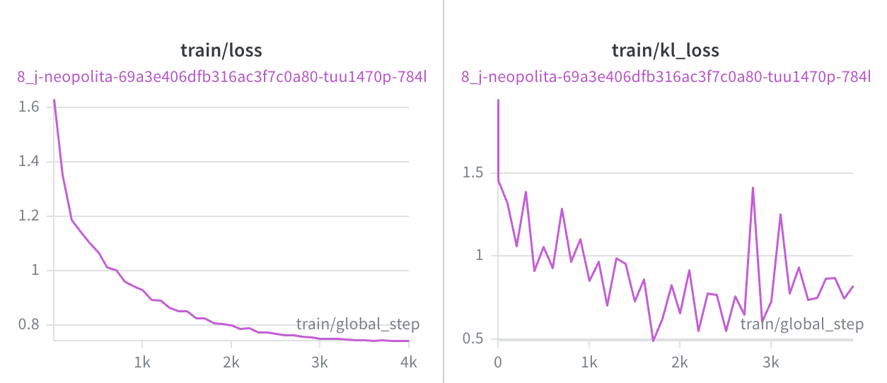
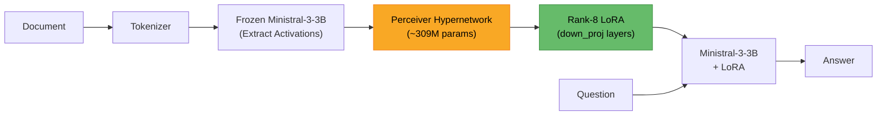

# Doc-to-LoRA: Ministral-3-3B Hypernetwork

> Built for the [Mistral AI Worldwide Hackathon 2026](https://worldwide-hackathon.mistral.ai/)

Porting [Sakana AI's Doc-to-LoRA](https://pub.sakana.ai/doc-to-lora/) to **Ministral-3-3B-Instruct-2512** — a hypernetwork that converts documents into LoRA adapters in sub-second time, enabling knowledge injection without context window overhead.

**Trained model**: [neopolita/doc-to-lora-ministral-3b-2512](https://huggingface.co/neopolita/doc-to-lora-ministral-3b-2512) | **W&B Report**: [Training Report](https://wandb.ai/neopolita/doc-to-lora/reports/Doc-to-LoRA-Ministral-3-3B-Hypernetwork--VmlldzoxNjA3MTU0MQ?accessToken=l7i7okr73q08opoazc563pl0h5uopixry7f6a680y9zwqno7pr4lw641cjow33rr) | **Base model**: [mistralai/Ministral-3-3B-Instruct-2512](https://huggingface.co/mistralai/Ministral-3-3B-Instruct-2512)

### Used by: Thoth Agent

The trained hypernetwork powers [**Thoth**](https://github.com/Neopolita/thoth), also built for the [Mistral AI Worldwide Hackathon 2026](https://worldwide-hackathon.mistral.ai/). Thoth is an agent that uses Doc-to-LoRA to alleviate context size pressure — instead of feeding entire documents into the context window, it converts them into LoRA adapters on the fly, freeing up the context for reasoning and conversation while retaining document knowledge in the model's weights. Thoth includes an MLX-based inference implementation, enabling the trained hypernetwork to run natively on Apple Silicon Macs.

### Results



| Metric           | Value               |
| ---------------- | ------------------- |
| Final KL Loss    | 0.824               |
| Final Train Loss | 0.744               |
| Training Steps   | 4,000               |
| Training Time    | ~8.2 hours          |
| Hardware         | 4x NVIDIA A100 80GB |

---

## What is Doc-to-LoRA?

Doc-to-LoRA is a Perceiver-based hypernetwork that reads a document and generates a rank-8 LoRA adapter for a target LLM. Instead of stuffing documents into the context window at inference time, the model "absorbs" the document into its weights via the generated LoRA.

**Key properties:**
- Sub-second LoRA generation from any document
- No context window consumed at inference time
- Composable: long documents are chunked and their LoRAs composed along the rank dimension
- Original implementation targets Gemma-2-2B; I ported it to Ministral-3-3B

### Architecture



### Why Not RAG?

|                     | Doc-to-LoRA                                       | RAG                                       |
| ------------------- | ------------------------------------------------- | ----------------------------------------- |
| **Context window**  | Free -- knowledge lives in LoRA weights           | Consumed by retrieved chunks              |
| **Latency**         | Sub-second LoRA generation, then normal inference | Retrieval + reranking at every query      |
| **Knowledge depth** | Full document absorbed into weights               | Limited to retrieved snippets             |
| **Composability**   | Multiple document LoRAs can be composed           | Context window limits how many chunks fit |
| **Trade-off**       | Requires training a hypernetwork                  | Works out of the box with any LLM         |

Doc-to-LoRA is complementary to RAG -- it works best for documents that are queried repeatedly, where the upfront cost of LoRA generation pays off across many queries.

## What I Did

### 1. Model Porting: Gemma-2-2B &rarr; Ministral-3-3B

Ministral-3-3B-Instruct-2512 presented several compatibility challenges with the existing codebase:

- **Multimodal architecture**: The model is packaged as `Mistral3ForConditionalGeneration` (Pixtral-like), but I only need the text-only `MistralForCausalLM`. I implemented an extraction pipeline that loads the multimodal model, saves the language model to a temp directory, and reloads it with flash attention + optional quantization.

- **FP8 weights**: The default checkpoint uses FP8 quantization incompatible with both vLLM 0.8.5 and transformers 4.51.3. I switched to the official BF16 variant (`Ministral-3-3B-Instruct-2512-BF16`) using a `BF16_VARIANTS` mapping that keeps the original model name as the logical identifier throughout the codebase.

- **Tekken v13 tokenizer**: Required upgrading `mistral-common>=1.9.0` and patching vLLM 0.8.5's Mistral tokenizer assertions. I also created a custom chat template for the model.

- **Config registration**: The `ministral3` model type isn't recognized by transformers 4.51.3, so I register it as a `MistralConfig` at import time.

### 2. Training Pipeline

The training uses context distillation:
1. The target model reads a document and answers questions (teacher signal with logprobs)
2. The hypernetwork generates a LoRA from the same document
3. The model *without* the document but *with* the generated LoRA tries to answer the same questions
4. KL divergence loss between the teacher (full context) and student (LoRA only) logprobs

**Training data:** 4 compact QA datasets:
- SQuAD (~15k contexts) — Wikipedia factual QA
- DROP (~10k contexts) — Discrete reasoning
- ROPES (~1.5k contexts) — Science cause/effect reasoning
- PwC (~140 contexts) — Academic papers

**Infrastructure:**
- Self-generated response data using Ministral-3-3B via vLLM 0.8.5
- Training on 4x NVIDIA A100 (80GB) via HuggingFace Jobs
- Tracked with Weights & Biases

### 3. Key Technical Challenges Solved

| Challenge                                             | Solution                                                                                 |
| ----------------------------------------------------- | ---------------------------------------------------------------------------------------- |
| FP8 weights produce garbage text                      | Switched to official BF16 variant                                                        |
| PixtralVisionModel rejects flash_attention_2 and sdpa | Load multimodal on CPU with eager, extract language model, reload with flash_attention_2 |
| BitsAndBytes NF4 quantized state_dict size mismatch   | Save/reload via temp directory instead of direct state_dict transfer                     |
| `np.empty` logprobs arrays with uninitialized memory  | Replaced with `np.zeros`/`np.full` for safe defaults                                     |
| vLLM 0.8.5 incompatible with Ministral-3-3B tokenizer | Runtime patches for `skip_special_tokens` assertion and unknown weight keys              |

## Repository

Forked from [SakanaAI/doc-to-lora](https://github.com/SakanaAI/doc-to-lora) with modifications for Ministral-3-3B support.

Key modified/added files:
- `src/ctx_to_lora/model_loading.py` — BF16 variant mapping, multimodal extraction, config registration
- `scripts/extract_language_model.py` — Extract text-only model from multimodal checkpoint
- `configs/main_exp/ministral-3b/` — Training configs for Ministral-3-3B
- `chat_templates/mistralai/Ministral-3-3B-Instruct-2512.jinja` — Chat template
- `scripts/hf_cloud/` — HuggingFace Jobs training scripts

## Limitations

- **Smaller training set**: Trained on a 10% subset of 4 compact QA datasets, without the FineWeb QA dataset used in the original paper. This may limit generalization to out-of-domain documents.
- **Fewer training steps**: 4,000 steps vs ~20,000 in the original Gemma-2-2B training. Longer training with more data would likely improve quality.
- **Single-document focus**: Each LoRA is generated from a single document chunk (up to 2,048 tokens). Very long documents require chunking and LoRA composition, which was not extensively evaluated.

## License

This repository is a fork of [SakanaAI/doc-to-lora](https://github.com/SakanaAI/doc-to-lora), which does not specify a license. Please refer to Sakana AI for licensing terms regarding the original code and methodology.

## References

- [Doc-to-LoRA: Sub-Second Knowledge Injection into LLMs via Document-to-LoRA Translation](https://pub.sakana.ai/doc-to-lora/) — Sakana AI, February 2026
- [Ministral-3-3B-Instruct-2512](https://huggingface.co/mistralai/Ministral-3-3B-Instruct-2512) — Mistral AI

## Citation

```bibtex
@article{doc-to-lora,
  title={Doc-to-LoRA: Sub-Second Knowledge Injection into LLMs via Document-to-LoRA Translation},
  author={Sakana AI},
  year={2026},
  url={https://pub.sakana.ai/doc-to-lora/}
}
```