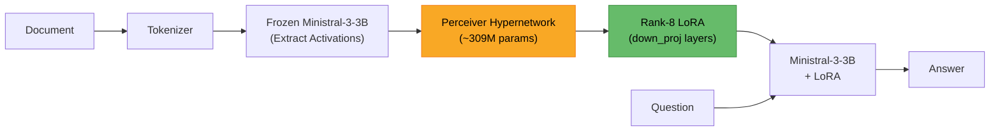

---
language:
  - en
library_name: transformers
tags:
  - hypernetwork
  - lora
  - doc-to-lora
  - perceiver
  - context-distillation
  - mistral
  - ministral
base_model: mistralai/Ministral-3-3B-Instruct-2512
datasets:
  - rajpurkar/squad
  - ucinlp/drop
  - allenai/ropes
pipeline_tag: text-generation
---

# Doc-to-LoRA: Ministral-3-3B Hypernetwork

> Built for the [Mistral AI Worldwide Hackathon 2026](https://worldwide-hackathon.mistral.ai/)

A Perceiver-based hypernetwork that converts documents into rank-8 LoRA adapters for [Ministral-3-3B-Instruct-2512](https://huggingface.co/mistralai/Ministral-3-3B-Instruct-2512) in sub-second time, enabling knowledge injection without context window overhead.

Ported from [Sakana AI's Doc-to-LoRA](https://pub.sakana.ai/doc-to-lora/) (originally targeting Gemma-2-2B) to Ministral-3-3B.

## Used by: Thoth Agent

This hypernetwork powers [**Thoth**](https://github.com/Neopolita/thoth), also built for the [Mistral AI Worldwide Hackathon 2026](https://worldwide-hackathon.mistral.ai/). Thoth is an agent that uses Doc-to-LoRA to alleviate context size pressure -- instead of feeding entire documents into the context window, it converts them into LoRA adapters on the fly, freeing up the context for reasoning and conversation while retaining document knowledge in the model's weights. Thoth includes an MLX-based inference implementation, enabling the trained hypernetwork to run natively on Apple Silicon Macs.

## How It Works

Doc-to-LoRA is a Perceiver-based hypernetwork (~309M parameters) that reads a document and generates a rank-8 LoRA adapter for Ministral-3-3B's MLP `down_proj` layers. Instead of stuffing documents into the context window at inference time, the model "absorbs" the document into its weights via the generated LoRA.

**Key properties:**
- Sub-second LoRA generation from any document
- No context window consumed at inference time
- Composable: long documents are chunked and their LoRAs composed along the rank dimension

### Architecture



### Why Not RAG?

|                     | Doc-to-LoRA                                       | RAG                                       |
| ------------------- | ------------------------------------------------- | ----------------------------------------- |
| **Context window**  | Free -- knowledge lives in LoRA weights           | Consumed by retrieved chunks              |
| **Latency**         | Sub-second LoRA generation, then normal inference | Retrieval + reranking at every query      |
| **Knowledge depth** | Full document absorbed into weights               | Limited to retrieved snippets             |
| **Composability**   | Multiple document LoRAs can be composed           | Context window limits how many chunks fit |
| **Trade-off**       | Requires training a hypernetwork                  | Works out of the box with any LLM         |

Doc-to-LoRA is complementary to RAG -- it works best for documents that are queried repeatedly, where the upfront cost of LoRA generation pays off across many queries.

## Results

**W&B Report**: [Training Report](https://wandb.ai/neopolita/doc-to-lora/reports/Doc-to-LoRA-Ministral-3-3B-Hypernetwork--VmlldzoxNjA3MTU0MQ?accessToken=l7i7okr73q08opoazc563pl0h5uopixry7f6a680y9zwqno7pr4lw641cjow33rr)

### Training Charts


| Metric           | Value      |
| ---------------- | ---------- |
| Final Train Loss | 0.744      |
| Final KL Loss    | 0.824      |
| Training Steps   | 4,000      |
| Training Time    | ~8.2 hours |

## Training

Trained using **context distillation**:
1. Ministral-3-3B reads a document and answers questions (teacher signal with logprobs)
2. The hypernetwork generates a LoRA from the same document
3. The model *without* the document but *with* the generated LoRA tries to answer the same questions
4. KL divergence loss between the teacher (full context) and student (LoRA only) logprobs

### Training Data

Self-generated QA pairs (using Ministral-3-3B via vLLM) over 4 compact datasets:
- **SQuAD** -- Wikipedia factual QA
- **DROP** -- Discrete reasoning over paragraphs
- **ROPES** -- Science cause/effect reasoning
- **PwC** (Papers with Code) -- Academic papers

### Training Configuration

| Parameter                 | Value                                    |
| ------------------------- | ---------------------------------------- |
| Base model                | `mistralai/Ministral-3-3B-Instruct-2512` |
| LoRA rank                 | 8                                        |
| Target modules            | `down_proj`                              |
| Context encoder           | Per-layer activations                    |
| Latent queries            | 8                                        |
| Perceiver blocks          | 9                                        |
| Max steps                 | 4,000                                    |
| Gradient accumulation     | 8                                        |
| Max packed context length | 2,048                                    |
| Max packed input length   | 2,048                                    |
| KL loss                   | Enabled                                  |
| L1 regularization         | 0.1                                      |
| Hardware                  | 4x NVIDIA A100 80GB                      |

## Porting: Gemma-2-2B to Ministral-3-3B

Ministral-3-3B-Instruct-2512 presented several compatibility challenges with the original Doc-to-LoRA codebase:

| Challenge                                                         | Solution                                                           |
| ----------------------------------------------------------------- | ------------------------------------------------------------------ |
| Model packaged as multimodal (`Mistral3ForConditionalGeneration`) | Extract text-only `MistralForCausalLM` from the multimodal wrapper |
| FP8 weights incompatible with vLLM 0.8.5 and transformers 4.51.3  | Use official BF16 variant (`Ministral-3-3B-Instruct-2512-BF16`)    |
| Tekken v13 tokenizer not supported                                | Upgrade `mistral-common>=1.9.0`, patch vLLM tokenizer assertions   |
| `ministral3` model type unrecognized by transformers              | Register as `MistralConfig` at import time                         |

## Usage

This model is designed to be used with the [doc-to-lora](https://github.com/Neopolita/doc-to-lora) codebase or [Thoth](https://github.com/Neopolita/thoth) agent.

```python
# See the doc-to-lora repository for full usage instructions
# https://github.com/Neopolita/doc-to-lora
```

## Links

- **Training code**: [Neopolita/doc-to-lora](https://github.com/Neopolita/doc-to-lora)
- **Inference agent**: [Neopolita/thoth](https://github.com/Neopolita/thoth)
- **Base model**: [mistralai/Ministral-3-3B-Instruct-2512](https://huggingface.co/mistralai/Ministral-3-3B-Instruct-2512)
- **Original paper**: [Doc-to-LoRA: Sub-Second Knowledge Injection into LLMs](https://pub.sakana.ai/doc-to-lora/) (Sakana AI, Feb 2026)
- **Hackathon**: [Mistral AI Worldwide Hackathon 2026](https://worldwide-hackathon.mistral.ai/)

## Limitations

- **Smaller training set**: Trained on a 10% subset of 4 compact QA datasets, without the FineWeb QA dataset used in the original paper. This may limit generalization to out-of-domain documents.
- **Fewer training steps**: 4,000 steps vs ~20,000 in the original Gemma-2-2B training. Longer training with more data would likely improve quality.
- **Single-document focus**: Each LoRA is generated from a single document chunk (up to 2,048 tokens). Very long documents require chunking and LoRA composition, which was not extensively evaluated.

## License

This model is based on the [Doc-to-LoRA](https://github.com/SakanaAI/doc-to-lora) codebase by Sakana AI, which does not specify a license. Please refer to Sakana AI for licensing terms regarding the original code and methodology.

## Citation

```bibtex
@article{doc-to-lora,
  title={Doc-to-LoRA: Sub-Second Knowledge Injection into LLMs via Document-to-LoRA Translation},
  author={Sakana AI},
  year={2026},
  url={https://pub.sakana.ai/doc-to-lora/}
}
```
